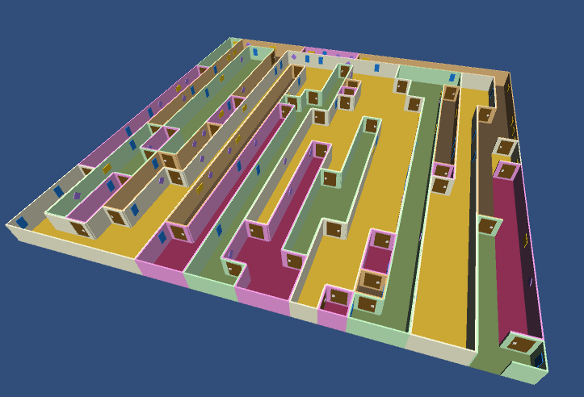

# Algorithm

This is a project that use Catlike Coding Tutorial and implement Binary Tree as our Maze Generator.

## The output of the maze

# Note
* Detailed explanation and demo video is inside Activity3_PCG.ppt
* The default  code consists of Binary Tree Algorithm. If you do want to run for Growing Tree, uncomment the comment at both "Maze.cs" and "MazeCell.cs"