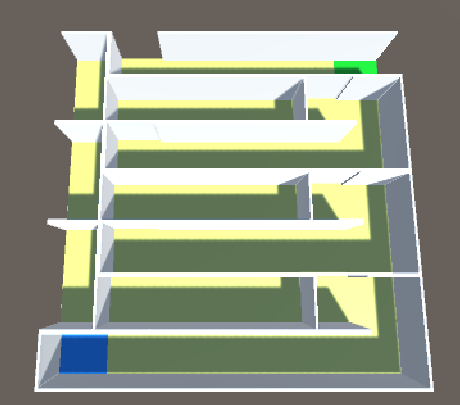

# Algorithm
Custom Maze Generator using my own custom algorithm. It moves through rows like Binary Tree Algorithm

## Output of the maze

# Note
* This is the modification of the Github Repo you provided from the Spectrum, not the catlikecoding.